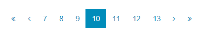

# Page Pod

Page Pod is an [Aurelia](http://aurelia.io/) custom element for pagination. It handles the "navigate to page x" links commonly found at the bottom of lists so that you don't have to.

## Using The Plugin

First, you will need to tell Aurelia about the page-pod plugin. Inside the `configure` function of your Aurelia application (usually in main.js), add page-pod as a plugin:

```javascript
export function configure(aurelia) {
  aurelia.use
    .standardConfiguration()
    .developmentLogging()
    .plugin("page-pod"); // This is the line you will need to add

  aurelia.start().then(a => a.setRoot());
}
```

After Aurelia knows about the plugin, you can use it inside any view:

```html
<page-pod
  router.bind="router"
  route-name="service-order-list"
  total-pages.bind="pageCount"
  current-page-number.bind="pageNumber">
</page-pod>
```

This will render something like this:



or if you are on a small display it will look like this:


## Building The Code

To build the code, follow these steps.

1. Ensure that [NodeJS](http://nodejs.org/) is installed. This provides the platform on which the build tooling runs.
2. From the project folder, execute the following command:

  ```shell
  npm install
  ```
3. Ensure that [Gulp](http://gulpjs.com/) is installed. If you need to install it, use the following command:

  ```shell
  npm install -g gulp
  ```
4. To build the code, you can now run:

  ```shell
  gulp build
  ```
5. You will find the compiled code in the `dist` folder, available in three module formats: AMD, CommonJS and ES6.

6. See `gulpfile.js` for other tasks.

## Issues

Please [report bugs](https://github.com/cusi-dev/page-pod/issues) on GitHub.
